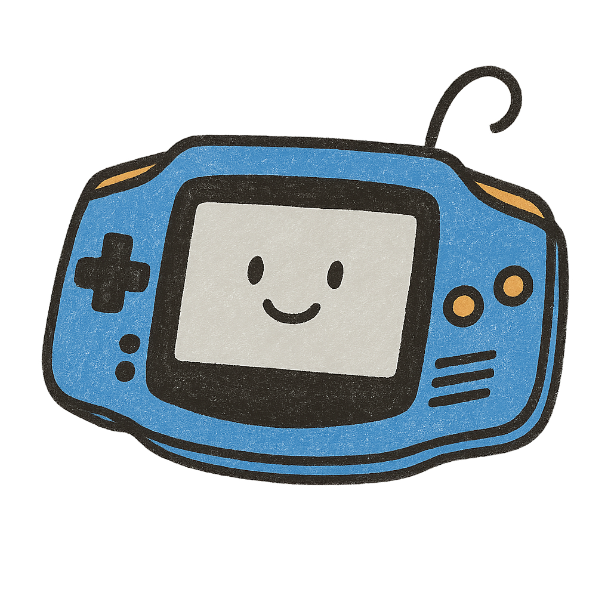

# VisualBoy Go



Um emulador de Game Boy e Game Boy Advance escrito em Go, inspirado no VisualBoyAdvance-M. Este projeto visa fornecer uma implementação moderna e eficiente da arquitetura do Game Boy com suporte a ROMs, save states, e uma interface gráfica intuitiva.

## 🎮 Sobre o Projeto

O VisualBoy Go é uma reimplementação completa do emulador VisualBoyAdvance-M em Go, projetado para oferecer alta performance e uma experiência de emulação fiel ao hardware original do Game Boy e Game Boy Advance.

### Características Principais

- **Suporte a múltiplas ROMs**: Cartridge, ROM, RAM, Save RAM
- **Sistema de Save States**: Gerenciamento de slots (0-9) com serialização completa
- **Interface Gráfica Moderna**: Baseada em SDL2 com OpenGL
- **Filtros de Vídeo**: Nearest, Bilinear, Scale2x, Scale3x
- **Controles Personalizáveis**: Mapeamento completo dos botões do Game Boy
- **Sistema de Som**: Implementação completa do APU (Audio Processing Unit)
- **Timer e Interrupções**: Emulação precisa dos sistemas internos
- **Modo Tela Cheia**: Suporte a alternância entre janela e tela cheia
- **Modo Pausa**: Controle de pausa/resumo da emulação

## 🏗️ Arquitetura do Projeto

O projeto segue uma arquitetura modular bem estruturada:

```
visual_go/
├── cmd/                    # Aplicação principal
│   └── main.go           # Ponto de entrada da aplicação
├── internal/              # Código interno do projeto
│   ├── core/             # Módulos de emulação
│   │   ├── gb/           # Emulação Game Boy
│   │   │   ├── cpu/      # CPU ARM7TDMI
│   │   │   ├── memory/   # Gerenciamento de memória
│   │   │   ├── video/    # Sistema de vídeo LCD
│   │   │   ├── sound/    # Sistema de áudio APU
│   │   │   ├── input/    # Sistema de input
│   │   │   ├── timer/    # Sistema de timer
│   │   │   ├── interrupts/ # Sistema de interrupções
│   │   │   └── savestate/ # Sistema de save states
│   │   └── gba/          # Emulação Game Boy Advance (futuro)
│   ├── gui/              # Interface gráfica
│   │   └── window.go     # Janela principal com OpenGL
│   └── utils/            # Utilitários
├── assets/               # Recursos do projeto
│   └── logo.png         # Logo do projeto
├── examples/             # Exemplos e ROMs de teste
├── go.mod               # Módulo Go
└── CHECKLIST.md         # Checklist de desenvolvimento
```

### Componentes Principais

#### CPU ([`internal/core/gb/cpu/cpu.go`](internal/core/gb/cpu/cpu.go))
- Implementação completa do ARM7TDMI
- Suporte a instruções ARM e Thumb
- Pipeline de execução com gerenciamento de flags
- Modos de operação (User, Supervisor, etc.)

#### Memória ([`internal/core/gb/memory/memory.go`](internal/core/gb/memory/memory.go))
- Mapeamento completo da memória do Game Boy
- Suporte a MBC1, MBC2, MBC3, MBC5
- Gerenciamento de Work RAM, High RAM, VRAM, OAM
- Cartridge loading com detecção automática

#### Vídeo ([`internal/core/gb/video/lcd.go`](internal/core/gb/video/lcd.go))
- Emulação precisa do LCD com 4 modos de vídeo
- Renderização de background, window e sprites
- Buffer de frame com 160x144 pixels
- Suporte a paleta de cores e blending

#### Áudio ([`internal/core/gb/sound/sound.go`](internal/core/gb/sound/sound.go))
- Implementação do APU com 4 canais
- Canais 1 e 2: Ondas quadradas com sweep e envelope
- Canal 3: Ondas customizadas
- Canal 4: Ruído pseudo-aleatório
- Frame sequencer a 512 Hz

#### Input ([`internal/core/gb/input/input.go`](internal/core/gb/input/input.go))
- Mapeamento completo dos 8 botões do Game Boy
- Sistema de interrupções para input
- Registrador JOYP com seleção de grupo
- Suporte a direcional e botões de ação

#### Timer ([`internal/core/gb/timer/timer.go`](internal/core/gb/timer/timer.go))
- Timer principal com frequências configuráveis
- DIV counter a 16384 Hz
- TIMA com overflow handling
- Sistema de interrupções para timer

#### Interrupções ([`internal/core/gb/interrupts/interrupts.go`](internal/core/gb/interrupts/interrupts.go))
- Sistema completo de interrupções com prioridades
- 5 tipos de interrupção: V-Blank, LCD STAT, Timer, Serial, Joypad
- Master Enable (IME) e controle de flags
- Vetores de interrupção corretos

#### Save States ([`internal/core/gb/savestate/savestate.go`](internal/core/gb/savestate/savestate.go))
- Serialização completa do estado do emulador
- Sistema de slots (0-9) para múltiplos save states
- Validação de integridade e versionamento
- Timestamp e informações da ROM

## 🚀 Instalação e Build

### Pré-requisitos

- Go 1.19 ou superior
- SDL2 development libraries
- OpenGL development libraries

### Instalação das Dependências

#### Linux (Ubuntu/Debian)
```bash
sudo apt-get update
sudo apt-get install -y libsdl2-dev libsdl2-image-dev libgl1-mesa-dev libglu1-mesa-dev
```

#### macOS
```bash
brew install sdl2
```

#### Windows
Baixe e instale as bibliotecas SDL2 do site oficial: [SDL2 Download](https://www.libsdl.org/download-2.0.php)

### Build do Projeto

```bash
# Clonar o repositório
git clone https://github.com/seu-usuario/visualboy-go.git
cd visualboy-go

# Baixar dependências
go mod download

# Compilar o projeto
go build -o visualboy-go cmd/main.go

# Executar
./visualboy-go
```

### Execução Direta

```bash
# Executar sem compilar
go run cmd/main.go
```

## 🎮 Como Usar

### Interface Principal

A interface do VisualBoy Go oferece:

- **Carregar ROM**: Use `File > Open` ou arraste uma ROM para a janela
- **Controles**: Mapeie os botões do Game Boy no menu `Settings > Controls`
- **Save States**: Salve/Carregue estados usando `File > Save State` / `File > Load State`
- **Filtros de Vídeo**: Altere o filtro de vídeo em `Settings > Video Filter`
- **Tela Cheia**: Pressione `F11` ou use `View > Fullscreen`
- **Pausa**: Pressione `Space` ou use `Emulation > Pause`

### Controles do Teclado

| Tecla | Função |
|-------|--------|
| `F11` | Alternar tela cheia |
| `Space` | Pausar/Resumir |
| `1-9` | Carregar save state do slot correspondente |
| `Shift + 1-9` | Salvar save state no slot correspondente |
| `Esc` | Sair do emulador |

### Save States

O sistema de save states permite salvar o progresso do jogo em 10 slots diferentes:

```bash
# Salvar no slot 1
Shift + 1

# Carregar do slot 1
1
```

Cada save state contém:
- Estado completo da CPU (registradores, flags, PC, SP)
- Estado da memória (WRAM, HRAM, VRAM, OAM)
- Estado do LCD (registradores, modo, ciclos)
- Estado do timer (DIV, TIMA, TMA, TAC)
- Estado do input (botões pressionados, JOYP)
- Estado do som (canais, Wave RAM)
- Estado das interrupções (flags, enable)

## 🛠️ Desenvolvimento

### Estrutura de Código

O projeto segue as melhores práticas de Go:

- **Modularização**: Cada componente está separado em seu próprio pacote
- **Interfaces**: Uso extensivo de interfaces para acoplamento fraco
- **Documentação**: Código bem documentado com comentários em português
- **Testes**: Estrutura preparada para testes unitários

### Adicionando Novas ROMs

Para adicionar suporte a novos tipos de cartridge:

1. Modifique o arquivo [`memory.go`](internal/core/gb/memory/memory.go)
2. Adicione o novo MBC na função `LoadCartridge()`
3. Implemente a lógica de mapeamento de memória
4. Adicione testes para o novo tipo

### Extensões Futuras

Planejadas para versões futuras:

- Suporte a Game Boy Advance
- Netplay multiplayer
- Gravação de vídeos
- Filtros de áudio
- Cheat codes
- Save states na nuvem
- Suporte a ROMs ZIP/RAR

## 📋 Checklist de Desenvolvimento

O projeto inclui um checklist detalhado em [`CHECKLIST.md`](CHECKLIST.md) com:

- [x] Análise de arquivos principais
- [x] Exploração da estrutura do projeto
- [x] Leitura da documentação existente
- [x] Criação do README.md completo
- [x] Adição da referência à logo.png

## 🤝 Contribuição

Contribuições são bem-vindas! Por favor:

1. Faça um fork do projeto
2. Crie uma branch para sua feature: `git checkout -b feature/nova-feature`
3. Commit suas mudanças: `git commit -am 'Adiciona nova feature'`
4. Push para a branch: `git push origin feature/nova-feature`
5. Abra um Pull Request

## 📄 Licença

Este projeto está sob licença MIT. Veja o arquivo [LICENSE](LICENSE) para mais detalhes.

## 🙏 Agradecimentos

- Inspirado no VisualBoyAdvance-M
- Agradecimentos à comunidade de emulação
- Bibliotecas SDL2 e OpenGL por fornecerem a base gráfica

## 📞 Contato

- GitHub Issues: [Reportar Bugs](https://github.com/seu-usuario/visualboy-go/issues)
- Email: seu-email@exemplo.com

---

**VisualBoy Go** - Trazendo a nostalgia do Game Boy para a era moderna com Go! 🎮